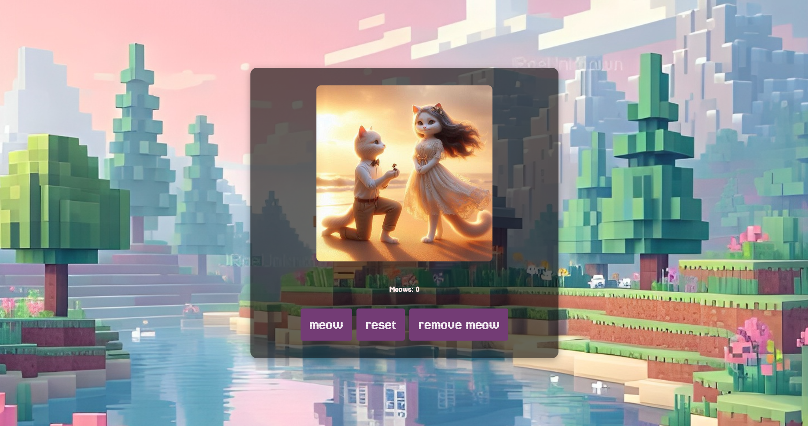
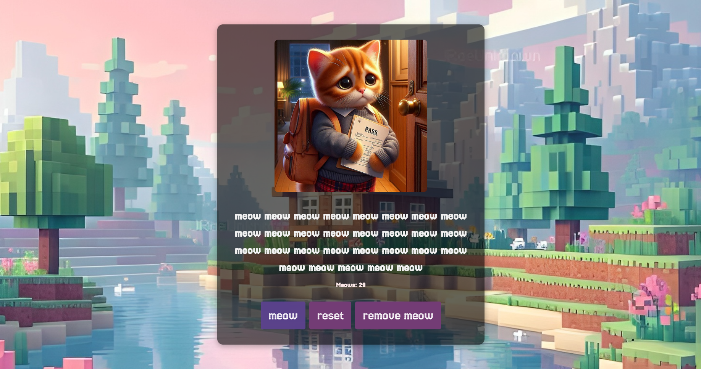

# Meow Symphony 🎶

Welcome to **Meow Symphony**, the groundbreaking(far fetched) app that lets you orchestrate a choir of "meows" with just the power of… your index finger ! who knew clicking on a button could bring such joy (a specific kind)😸


## Basic Details
### Team Name: HUSE


### Team Members
- Team Lead: Andrea Tresa Tom - SJCET
- Member 2: Fida Fathim- SJCET
- Member 3: Annette George - SJCET


## The Inspiration 🐱

Ever wished you could compose an epic musical masterpiece made up entirely of cat meows? No? Well, now that idea exists in this world anyway, and you’re welcome. This app provides the perfect... or should i say purr-fecc... blend of uselessness and an existential realization of how far we’ve come with technology and all the ways to use it and make it useless — all while giving you an auditory adventure filled with endless(it ends , only if you wish it does ) meowing.

https://github.com/user-attachments/assets/45fdd232-da11-4756-834e-fd4245a0e6ac

## What It Does 😹

- **Meow Button**: Hit the “meow” button,you can see a “meow,” your ears are blessed with a snippet of meow music, and an adorable cat story image is displayed to remind you that life has purpose.
  
- **Meow Counter**: Always keep track , be on track, why we have a meow counter . Serves the purpose of visualising your progress.
- **Reset**: In case you’ve gone overboard with the meows (it happens to the best of us), you can hit reset and come back to a place of zen (or the quiet before the next meow storm).

- **Remove Meow**: Accidentally meowed too much? we understand, You can shave off a meow. Tragic, but necessary.
# Screenshots




The landing screen , ready to start the meows 


Progress of Meows


## Technical Details (For the Curious) 👨‍💻👩‍💻

- **React**: The backbone of our meow masterpiece , meowsterpiec...
  
- **Audio**: We used the finest recorded meows from the finest kitties and created timestamps for that synchronized sound experience.
  
- **Vite**: Because waiting for bundling is so old , we are better than that . Vite is like the catnip of development tools, and you don’t know how you lived without it.
  
- **Audio**: We used the finest recorded meows and created timestamps for that ultimate synchronized sound experience.
  
- **Timestamps**: Because even a meow symphony needs precision, every meow comes in on cue. 🎶

## How It Works 🤔

1. **Click “meow”**: Adds a meow to the text, plays a segment of the epic meow song, and cycles through a heartwarming story .

2. **Meow Removal**: If you feel regret a meow(we consider all possibilities), this button will heal the wounds.

3. **Reset Button**: Completely lose control and need a fresh start? Got you there too , start over and do it again .


## Local Setup (Because Why Wouldn’t You?) 🔧

1. **Clone the repo:**

   ```bash
   git clone <repo-url>
   ```

2. **Navigate to the project directory:**

   ```bash
   cd meow-symphony
   ```

3. **Install dependencies:**

   ```bash
   npm install
   ```

4. **Start the app(How excitingggg!!!):**

   ```bash
   npm run dev
   ```

5. **And there we go , it is in your hands !**

## Known Bugs 🐜 (aka Unintended Features)

- Sometimes the meow chorus gets tired and needs a full reset ( If the meows ever get too much).

- The cats in the images are cute enough to make you forget about everything, so don’t blame us if you lose track of time and thank us if you lose track of time , means the app served its purpose of entertainment.

---

## The Deep Meaning Behind It 🧐

It’s a humorous reminder that sometimes, the simplest joys in life come from a cat’s meow (and from pressing a button repeatedly). Enjoy your time with Meow Symphony, and remember: every great composer started somewhere,This is our somewhere.

You can start somewhere , somewhen , and be just as great ,even greater , not meow composing but better things sure.

**Happy Meowing!** 🐾

A big Thank you to Tinkerhub and Useless Projects for allowing us to think outside the box and create something that is funnn and for laughs , learned a lot during the process ,and laughed a lot during the process ^ ^ !